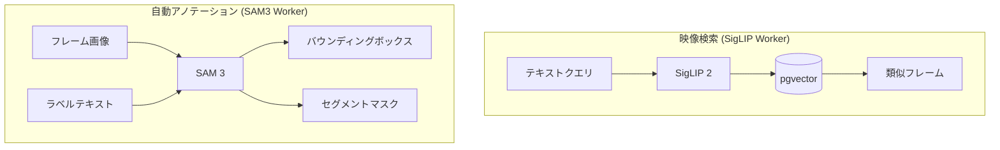
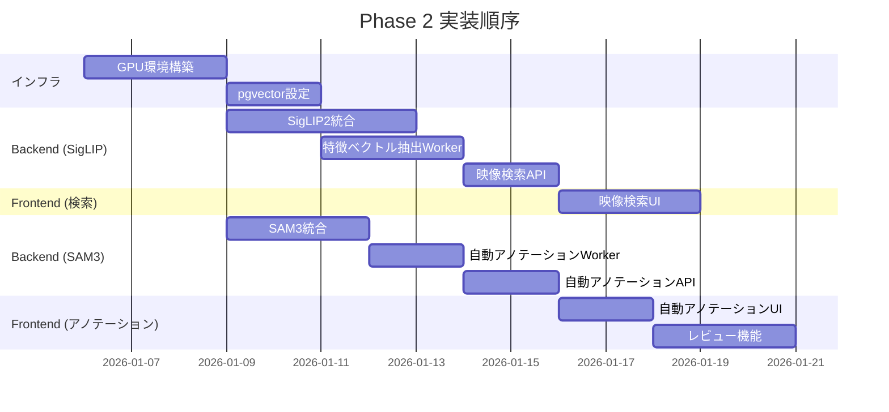

# Phase 2: AI Assist (AI支援機能) 詳細計画

**作成日時**: 2026-01-03
**Phase**: 2 - AI Assist
**期間目標**: 3-4週間

---

## 概要

Phase 2 では、AI による**自動アノテーション**と**映像検索機能**を実装する。

### 目標
- テキストクエリで類似フレームを検索できる
- 選択したフレームに自動でバウンディングボックスを生成できる
- 信頼度の低いアノテーションをレビューできる

### 完了基準
- [ ] 「cpu」と入力すると CPU が映ったフレームが検索できる
- [ ] 選択したフレームに自動でバウンディングボックスが生成される
- [ ] 信頼度の低いアノテーションをレビューできる

---

## Phase 1 vs Phase 2: ワークフロー比較

### Phase 1 (現状): 手動アノテーション

```
ユーザー
    │
    ▼
┌─────────────────────────────────────────────────────────────┐
│ 1. 映像アップロード                                          │
│    └─→ 自動でフレーム抽出 (FFmpeg)                          │
└─────────────────────────────────────────────────────────────┘
    │
    ▼
┌─────────────────────────────────────────────────────────────┐
│ 2. フレーム一覧から手動で選択                                │
│    └─→ 数百〜数千フレームを目視で確認 😰                     │
└─────────────────────────────────────────────────────────────┘
    │
    ▼
┌─────────────────────────────────────────────────────────────┐
│ 3. 各フレームで手動アノテーション                            │
│    └─→ 1つずつバウンディングボックスを描画 😰               │
└─────────────────────────────────────────────────────────────┘
    │
    ▼
┌─────────────────────────────────────────────────────────────┐
│ 4. COCO/YOLO エクスポート                                    │
└─────────────────────────────────────────────────────────────┘

⏱️ 所要時間: 数時間〜数日 (フレーム数に比例)
```

### Phase 2 (実装後): AI支援アノテーション

```
ユーザー
    │
    ▼
┌─────────────────────────────────────────────────────────────┐
│ 1. 映像アップロード                                          │
│    └─→ 自動でフレーム抽出 (FFmpeg)                          │
│    └─→ ✨ 自動で特徴ベクトル抽出 (SigLIP 2) [NEW]           │
└─────────────────────────────────────────────────────────────┘
    │
    ▼
┌─────────────────────────────────────────────────────────────┐
│ 2. ✨ テキスト検索でフレーム絞り込み [NEW]                   │
│    │                                                         │
│    │  検索: "cpu"                                            │
│    │     ↓                                                   │
│    │  SigLIP 2 がテキスト → ベクトル変換                     │
│    │     ↓                                                   │
│    │  pgvector で類似フレーム検索                            │
│    │     ↓                                                   │
│    │  CPU が映った 50 フレームを表示 ✅                      │
│    │                                                         │
│    └─→ 目的のフレームを素早く発見 😊                        │
└─────────────────────────────────────────────────────────────┘
    │
    ▼
┌─────────────────────────────────────────────────────────────┐
│ 3. ✨ 自動アノテーション [NEW]                               │
│    │                                                         │
│    │  [自動アノテーション] ボタンをクリック                   │
│    │     ↓                                                   │
│    │  SAM 3 がラベル名からバウンディングボックス生成          │
│    │     ↓                                                   │
│    │  信頼度スコア付きで結果表示                             │
│    │     ↓                                                   │
│    │  50 フレーム × 平均 3 オブジェクト = 150 件を自動生成 ✅ │
│    │                                                         │
│    └─→ 手動描画不要 😊                                      │
└─────────────────────────────────────────────────────────────┘
    │
    ▼
┌─────────────────────────────────────────────────────────────┐
│ 4. ✨ レビュー & 修正 [NEW]                                  │
│    │                                                         │
│    │  信頼度でフィルタリング                                  │
│    │     ↓                                                   │
│    │  信頼度 90%以上: 120件 → 一括承認 ✅                    │
│    │  信頼度 70-90%: 25件 → 目視確認して承認                 │
│    │  信頼度 70%未満: 5件 → 手動修正                         │
│    │                                                         │
│    └─→ 確認が必要なのは 30 件のみ 😊                        │
└─────────────────────────────────────────────────────────────┘
    │
    ▼
┌─────────────────────────────────────────────────────────────┐
│ 5. COCO/YOLO エクスポート                                    │
└─────────────────────────────────────────────────────────────┘

⏱️ 所要時間: 数十分〜数時間 (80%以上の工数削減)
```

---

## 具体的なユースケース: 「CPU を検出するモデルを作りたい」

### Step 1: 映像アップロード (既存 + 拡張)
```
ユーザー: 工場ラインの映像 (10分) をアップロード

システム:
  1. フレーム抽出: 1fps → 600フレーム生成
  2. [NEW] 各フレームの特徴ベクトル抽出 (SigLIP 2)
  3. [NEW] ベクトルを pgvector に保存
```

### Step 2: フレーム検索 (新機能)
```
ユーザー: 検索ボックスに "cpu" と入力

システム:
  1. "cpu" をテキストベクトルに変換 (SigLIP 2)
  2. pgvector で類似度検索
  3. 類似度の高い順に 50 フレームを表示

ユーザー: 「おお、CPU が映ったフレームだけ出てきた！」
```

### Step 3: 自動アノテーション (新機能)
```
ユーザー:
  1. 検索結果から 50 フレームを選択
  2. ラベル "cpu" を指定
  3. [自動アノテーション] ボタンをクリック

システム:
  1. SAM 3 が各フレームで "cpu" を検出
  2. バウンディングボックス + 信頼度スコアを生成
  3. 150 件のアノテーション候補を表示

ユーザー: 「150件が数分で生成された！」
```

### Step 4: レビュー (新機能)
```
システム: 信頼度でグループ分け
  - 高信頼度 (90%+): 120件 → 一括承認ボタン
  - 中信頼度 (70-90%): 25件 → 個別確認
  - 低信頼度 (70%未満): 5件 → 要修正

ユーザー:
  1. 高信頼度 120件を一括承認
  2. 中信頼度 25件を目視確認して承認
  3. 低信頼度 5件を手動修正

合計作業: 30件の確認 + 5件の修正 (従来: 150件すべて手動)
```

### Step 5: エクスポート (既存)
```
ユーザー: COCO 形式でエクスポート

結果: 高品質なアノテーションデータを短時間で取得
```

---

## 技術スタック

| コンポーネント | 技術 | 備考 |
|---------------|------|------|
| 映像検索 | SigLIP 2 + pgvector | Google DeepMind の最新モデル |
| 自動アノテーション | SAM 3 | r2s2 プロジェクトから流用可能 |
| ベクトル DB | pgvector (Supabase) | PostgreSQL 拡張 |
| SigLIP Worker | Celery + Docker (CUDA) | **専用コンテナ** (transformers stable) |
| SAM3 Worker | Celery + Docker (CUDA) | **専用コンテナ** (transformers dev) |

---

## アーキテクチャ

### コンテナ構成

```
┌─────────────────────────────────────────────────────────────────────────┐
│                         Docker Environment                               │
├─────────────────────────────────────────────────────────────────────────┤
│                                                                          │
│  ┌────────────┐  ┌────────────┐  ┌──────────────────┐                   │
│  │  Frontend  │  │  Backend   │  │   CPU Worker     │                   │
│  │  (Next.js) │  │  (FastAPI) │  │   (Celery)       │                   │
│  │            │  │            │  │                  │                   │
│  │  - UI      │  │  - REST API│  │  - フレーム抽出  │                   │
│  │  - SSR     │  │  - 認証    │  │  - エクスポート  │                   │
│  │            │  │  - タスク  │  │                  │                   │
│  └─────┬──────┘  └─────┬──────┘  └────────┬─────────┘                   │
│        │               │                  │                              │
│        │               ▼                  ▼                              │
│        │       ┌──────────────────────────────────┐                     │
│        │       │             Redis                │                     │
│        │       │        (Celery Broker)           │                     │
│        │       │                                  │                     │
│        │       │  Queues:                         │                     │
│        │       │  - default (CPU タスク)          │                     │
│        │       │  - siglip  (SigLIP Worker)       │                     │
│        │       │  - sam3    (SAM3 Worker)         │                     │
│        │       └───────────────┬──────────────────┘                     │
│        │                 ┌─────┴─────┐                                  │
│        │                 ▼           ▼                                  │
│        │       ┌─────────────┐ ┌─────────────┐                          │
│        │       │SigLIP Worker│ │ SAM3 Worker │  ← 分離コンテナ          │
│        │       │   (GPU)     │ │   (GPU)     │                          │
│        │       │             │ │             │                          │
│        │       │ - 特徴抽出  │ │ - 自動アノテ│                          │
│        │       │ - 検索      │ │ - マスク生成│                          │
│        │       │             │ │             │                          │
│        │       │ transformers│ │ transformers│                          │
│        │       │ (stable)    │ │ (dev)       │  ← 依存関係分離          │
│        │       │             │ │             │                          │
│        │       │ Q: siglip   │ │ Q: sam3     │                          │
│        │       └──────┬──────┘ └──────┬──────┘                          │
│        │              │               │                                  │
│        │              └───────┬───────┘                                  │
│        │                      ▼                                          │
│        │            ┌─────────────────┐                                  │
│        │            │   Model Cache   │                                  │
│        │            │    (Volume)     │                                  │
│        │            │    /models/     │                                  │
│        │            └─────────────────┘                                  │
│        │                                                                 │
│        └─────────────────────────────┐                                   │
│                                      │                                   │
│  ┌────────────┐  ┌────────────┐  ┌───▼────────┐  ┌────────────┐         │
│  │  Supabase  │  │  pgvector  │  │   MinIO    │  │            │         │
│  │ (Auth+DB)  │  │  (Vector)  │  │ (Storage)  │  │            │         │
│  │            │  │            │  │            │  │            │         │
│  │ PostgreSQL │  │ 埋め込み   │  │ 映像/フレーム│  │            │         │
│  │ 認証/RLS   │  │ ベクトル   │  │ モデル     │  │            │         │
│  └────────────┘  └────────────┘  └────────────┘  └────────────┘         │
│                                                                          │
└─────────────────────────────────────────────────────────────────────────┘
```

### コンテナ一覧

| コンテナ | ベースイメージ | 役割 | GPU |
|----------|---------------|------|-----|
| `frontend` | node:20 | Next.js UI | - |
| `backend` | python:3.12-slim | FastAPI REST API | - |
| `celery-worker` | python:3.12-slim | CPU タスク (FFmpeg等) | - |
| `siglip-worker` | nvidia/cuda:12.1 | SigLIP 2 推論 | **必要** |
| `sam3-worker` | nvidia/cuda:12.1 | SAM 3 推論 | **必要** |

### 分離のメリット

1. **依存関係の完全分離** - SigLIP (transformers stable) と SAM3 (transformers dev) の競合回避
2. **障害分離** - 一方がクラッシュしても他に影響なし
3. **独立スケーリング** - 負荷に応じて Worker 数を調整可能
4. **GPU 効率化** - Celery がタスクをシリアル実行し VRAM 競合を回避

### データフロー



---

## 流用可能なリソース

### r2s2/simulator からの流用

| ファイル | 用途 | 流用度 |
|---------|------|-------|
| `docker/cloud/Dockerfile.sam3` | SAM3 Docker イメージ | **高** - ほぼそのまま使用可能 |
| `src/mask/sam3_interactive.py` | SAM3 ラッパークラス | **高** - API を参考に実装 |
| `docs/SAM3_SAM3D_REFERENCE.md` | SAM3 技術仕様書 | **高** - 参照ドキュメント |
| `models/sam3/sam3.pt` | モデルファイル | **中** - HuggingFace から再取得推奨 |

### 新規実装が必要

| コンポーネント | 理由 |
|---------------|------|
| SigLIP 2 統合 | 過去に使用経験なし |
| pgvector 設定 | Supabase への拡張設定 |
| 特徴ベクトル抽出 Worker | フレーム処理パイプライン |
| 検索 UI | フロントエンド新規実装 |

---

## Issue 分割案

### 2.1 GPU 環境構築 (infra)
- **SigLIP Worker 用 Dockerfile 作成** (`Dockerfile.siglip`)
  - transformers stable 版
  - Celery queue: `siglip`
- **SAM3 Worker 用 Dockerfile 作成** (`Dockerfile.sam3`)
  - transformers dev 版
  - Celery queue: `sam3`
- docker-compose.gpu.yml に両サービス追加
- ローカル GPU 対応 (CUDA 12.1+)
- モデルキャッシュ用共有ボリューム設定

### 2.2 SigLIP 2 統合 - Backend (backend)
- SigLIP 2 モデル統合 (Hugging Face transformers)
- 画像特徴ベクトル抽出サービス
- テキスト特徴ベクトル抽出サービス
- ベクトル類似度計算ロジック

### 2.3 pgvector 設定 (infra)
- Supabase に pgvector 拡張を有効化
- frames テーブルに embedding カラム追加
- ベクトルインデックス (IVFFlat/HNSW) 設定
- 類似検索 SQL 関数作成

### 2.4 特徴ベクトル抽出 Worker (backend)
- フレーム抽出時に自動で特徴ベクトルを生成
- Celery タスクとして実装
- バッチ処理対応
- 進捗状況の管理

### 2.5 映像検索 API (backend)
- テキスト → 類似フレーム検索エンドポイント
- 検索結果のスコアリング
- ページネーション対応

### 2.6 映像検索 UI (frontend)
- 検索ボックス UI
- 検索結果グリッド表示
- フレーム選択とプレビュー
- 検索履歴

### 2.7 SAM 3 統合 - Backend (backend)
- SAM 3 モデル統合 (r2s2 から流用)
- テキストプロンプト → バウンディングボックス生成
- 信頼度スコア算出
- マスク生成オプション

### 2.8 自動アノテーション Worker (backend)
- Celery タスクとして実装
- バッチ処理対応
- エラーハンドリング

### 2.9 自動アノテーション API (backend)
- フレーム + ラベル → アノテーション生成エンドポイント
- 信頼度スコア付きレスポンス
- 一括処理対応

### 2.10 自動アノテーション UI (frontend)
- 「自動アノテーション」ボタン
- 進捗表示
- 結果プレビュー

### 2.11 アノテーションレビュー機能 (frontend, backend)
- 信頼度によるフィルタリング
- 一括承認 UI
- 修正ワークフロー
- レビュー進捗表示

---

## 実装順序



---

## 技術詳細

### SigLIP 2

#### モデル選定
| モデル | パラメータ | VRAM | 推奨用途 |
|-------|-----------|------|---------|
| `google/siglip2-base-patch16-256` | 86M | ~2GB | 開発/テスト |
| `google/siglip2-so400m-patch14-384` | 400M | ~4GB | **本番推奨** |
| `google/siglip2-giant-opt-patch16-256` | 1B | ~8GB | 高精度要求時 |

#### コード例
```python
from transformers import AutoModel, AutoProcessor
import torch

model = AutoModel.from_pretrained("google/siglip2-so400m-patch14-384")
processor = AutoProcessor.from_pretrained("google/siglip2-so400m-patch14-384")

# 画像エンベディング
inputs = processor(images=[image], return_tensors="pt")
with torch.no_grad():
    image_embeddings = model.get_image_features(**inputs)
# image_embeddings.shape: [1, 1152]

# テキストエンベディング
text_inputs = processor(text=["cpu", "hdd"], padding="max_length", return_tensors="pt")
with torch.no_grad():
    text_embeddings = model.get_text_features(**text_inputs)
```

### SAM 3

#### r2s2 からの流用方針
1. `Dockerfile.sam3` をベースに Argus 用にカスタマイズ
2. `sam3_interactive.py` の `SAM3Interactive` クラスを参考に実装
3. テキストプロンプトによるセグメンテーション機能を活用

#### 主要 API
```python
from sam3.model_builder import build_sam3_image_model
from sam3.model.sam3_image_processor import Sam3Processor

model = build_sam3_image_model()
processor = Sam3Processor(model)

# 画像設定
inference_state = processor.set_image(image)

# テキストプロンプトでセグメンテーション
output = processor.set_text_prompt(
    state=inference_state,
    prompt="cpu"  # ラベル名
)

masks = output["masks"]    # セグメンテーションマスク
boxes = output["boxes"]    # バウンディングボックス
scores = output["scores"]  # 信頼度スコア
```

### pgvector

#### スキーマ変更
```sql
-- pgvector 拡張有効化
CREATE EXTENSION IF NOT EXISTS vector;

-- frames テーブルに embedding カラム追加
ALTER TABLE frames ADD COLUMN embedding vector(1152);

-- ベクトルインデックス作成 (HNSW)
CREATE INDEX ON frames USING hnsw (embedding vector_cosine_ops);

-- 類似検索関数
CREATE FUNCTION search_similar_frames(
    query_embedding vector(1152),
    project_id uuid,
    limit_count int DEFAULT 20
) RETURNS TABLE (
    frame_id uuid,
    similarity float
) AS $$
    SELECT id, 1 - (embedding <=> query_embedding) as similarity
    FROM frames
    WHERE project_id = $2
    ORDER BY embedding <=> query_embedding
    LIMIT $3;
$$ LANGUAGE SQL;
```

---

## リスクと対策

| リスク | 影響 | 対策 |
|-------|------|------|
| GPU 環境構築の複雑さ | 開発遅延 | Docker で環境を完全にコンテナ化 |
| SigLIP 2 未経験 | 学習コスト | HuggingFace のドキュメントとサンプルを活用 |
| SAM 3 API 変更 | 実装修正 | r2s2 の動作確認済みコードをベースに |
| VRAM 不足 | 実行エラー | モデルサイズの選択肢を用意 |
| ~~依存関係の衝突~~ | ~~実行エラー~~ | ✅ **解決済み**: SigLIP/SAM3 を分離コンテナで実行 |

---

## 参照ドキュメント

### SigLIP 2
- [SigLIP 2 論文 (arXiv)](https://arxiv.org/pdf/2502.14786)
- [HuggingFace Blog - SigLIP 2](https://huggingface.co/blog/siglip2)
- [HuggingFace Docs - SigLIP](https://huggingface.co/docs/transformers/en/model_doc/siglip)

### SAM 3
- [SAM 3 GitHub](https://github.com/facebookresearch/sam3)
- r2s2 プロジェクト: `/home/hexyl/workspace/r2s2/simulator/docs/SAM3_SAM3D_REFERENCE.md`

### pgvector
- [pgvector GitHub](https://github.com/pgvector/pgvector)
- [Supabase Vector](https://supabase.com/docs/guides/ai/vector-columns)

---

## 次のステップ

1. この計画のレビューと承認
2. GitHub Issue の作成 (2.1 ~ 2.11)
3. Phase 2 用 Milestone 作成
4. GPU 環境構築から着手
