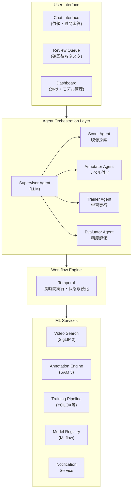
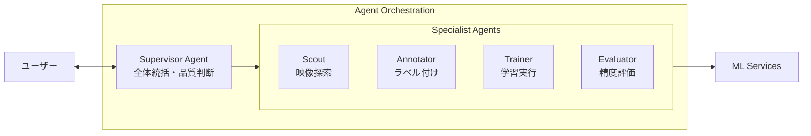
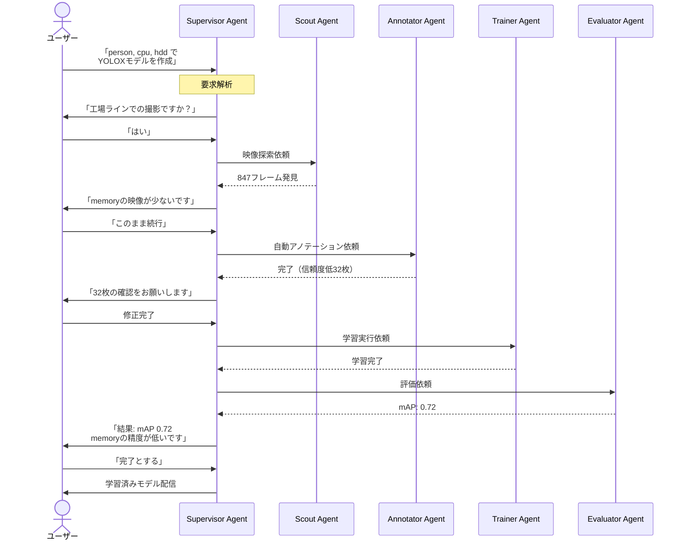
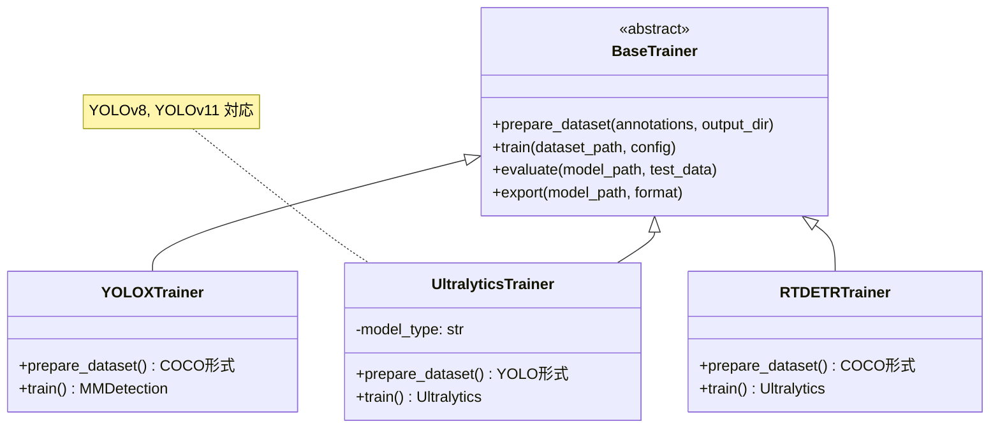
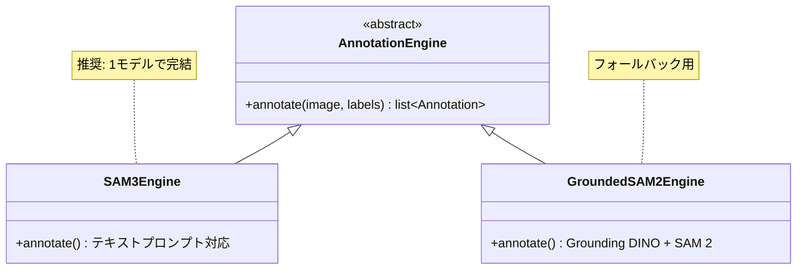

# Argus - システムアーキテクチャ

## 全体構成図

## レイヤー詳細

### 1. User Interface Layer

| コンポーネント | 役割 | 技術 |
|--------------|------|------|
| Chat Interface | 自然言語でのモデル作成依頼、AIからの質問応答 | Next.js + WebSocket |
| Review Queue | AIが判断に迷った箇所の確認依頼一覧 | Next.js |
| Dashboard | プロジェクト管理、進捗確認、モデル一覧 | Next.js |
| Annotation UI | 手動修正用のバウンディングボックス編集 | Konva.js (react-konva) |

### 2. Agent Orchestration Layer

AIエージェントがユーザー要求を解釈し、タスクを自律的に実行する層。

#### Supervisor Agent
- **役割**: 全体の統括、タスク分解、品質判断
- **技術**: LiteLLM + Claude Sonnet 4.5 (デフォルト、他モデルに切り替え可能)
- **責務**:
  - ユーザー要求の解釈・明確化
  - 各専門エージェントへのタスク委譲
  - Human-in-the-Loop の判断（いつユーザーに確認するか）
  - 最終品質の評価

#### Scout Agent
- **役割**: 映像データからターゲットオブジェクトを含むシーンを探索
- **技術**: SigLIP 2 + pgvector
- **入力**: ラベルリスト（例: "person", "cpu", "hdd"）
- **出力**: 該当フレームの候補リスト + 信頼度スコア

#### Annotator Agent
- **役割**: 自動アノテーション生成
- **技術**: SAM 3 (Segment Anything Model 3)
- **入力**: フレーム画像 + テキストプロンプト（ラベル）
- **出力**: バウンディングボックス + セグメントマスク
- **特徴**: テキストプロンプトで全インスタンスを一括検出（Grounding DINO不要）

#### Trainer Agent
- **役割**: モデル学習の実行
- **技術**: YOLOX, YOLOv11, RT-DETR 等（プラガブル設計）
- **入力**: アノテーション済みデータセット
- **出力**: 学習済みモデル + 学習曲線

#### Evaluator Agent
- **役割**: モデル精度の評価・分析
- **技術**: COCO評価メトリクス
- **入力**: 学習済みモデル + テストデータ
- **出力**: mAP、クラス別精度、改善提案

### 3. Workflow Engine Layer

長時間実行されるワークフローを管理し、障害時の復旧を保証する。

- **技術**: Temporal
- **責務**:
  - ワークフロー状態の永続化
  - Human-in-the-Loop での待機（数時間〜数日）
  - リトライ・エラーハンドリング
  - ワークフロー可視化

### 4. ML Services Layer

| サービス | 役割 | 技術 |
|---------|------|------|
| Video Search | セマンティック検索 | SigLIP 2 + pgvector |
| Annotation Engine | 自動ラベリング | SAM 3 |
| Training Pipeline | モデル学習 | YOLOX / YOLOv11 / RT-DETR (プラガブル) |
| Model Registry | モデルバージョン管理 | MLflow |
| Notification Service | ユーザーへの通知 | WebSocket + Email |

## データフロー

### 典型的なワークフロー

## モデル拡張アーキテクチャ

### Training Pipeline の抽象化

### 対応モデル一覧

| カテゴリ | モデル | 特徴 | 優先度 |
|---------|-------|------|-------|
| **物体検出** | YOLOX | バランス型、初期実装 | Phase 3 |
| | YOLOv11 | 最新、高速、使いやすい | Phase 5 |
| | RT-DETR | Transformer、高精度 | Phase 5 |
| **セグメンテーション** | YOLOv11-seg | 高速 | 将来 |
| | Mask2Former | SOTA精度 | 将来 |
| **姿勢推定** | YOLOv11-pose | 高速 | 将来 |

### Annotation Engine の抽象化

## 技術スタック一覧

| カテゴリ | 技術 | 選定理由 |
|---------|------|---------|
| Frontend | Next.js 14 (App Router) | SSR、API Routes、React Server Components |
| Canvas操作 | Konva.js (react-konva) | React統合、レイヤー分離によるパフォーマンス |
| Backend API | FastAPI | 非同期対応、型安全、ML統合が容易 |
| Agent Framework | LangGraph | 複雑なステートマシン、HITL対応 |
| Workflow Engine | Temporal | 長時間実行、障害復旧 |
| LLM Gateway | LiteLLM | マルチプロバイダー対応、セルフホスト可能 |
| LLM (デフォルト) | Claude Sonnet 4.5 | 複雑な判断、日本語対応 |
| 映像検索 | SigLIP 2 + pgvector | 2025年SOTA、多言語対応、高効率 |
| 自動アノテーション | SAM 3 | テキストプロンプト対応、高精度 |
| 学習フレームワーク | YOLOX / YOLOv11 / RT-DETR | プラガブル設計で拡張可能 |
| Model Registry | MLflow | バージョン管理、比較 |
| 認証 | Supabase Auth | OAuth、Magic Link対応 |
| Database | Supabase (PostgreSQL) | RLS、リアルタイム |
| Object Storage | S3 (+ MinIO for local) | スケーラブル |
| Message Queue | Redis (Celery) | 軽量スタート |
| Container | Docker / ECS / EKS | スケーラビリティ |
