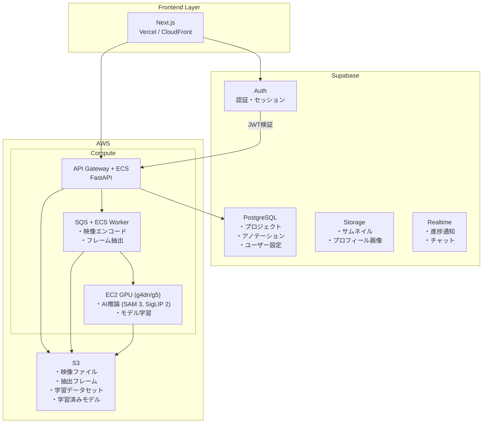
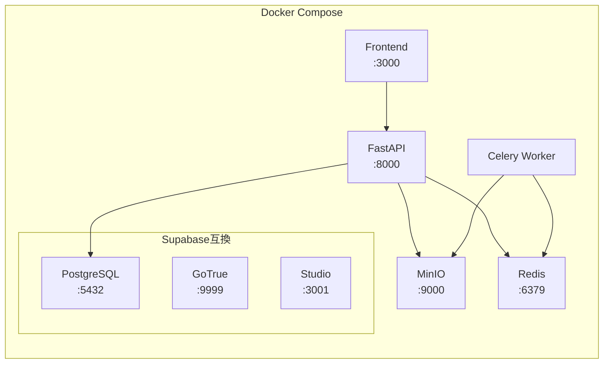
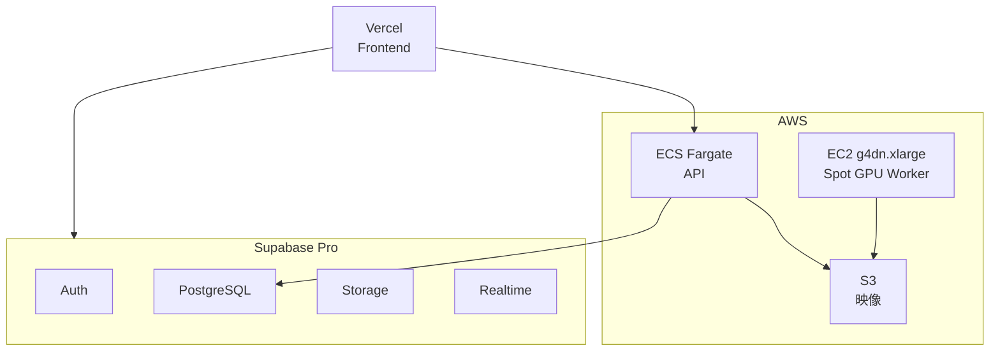
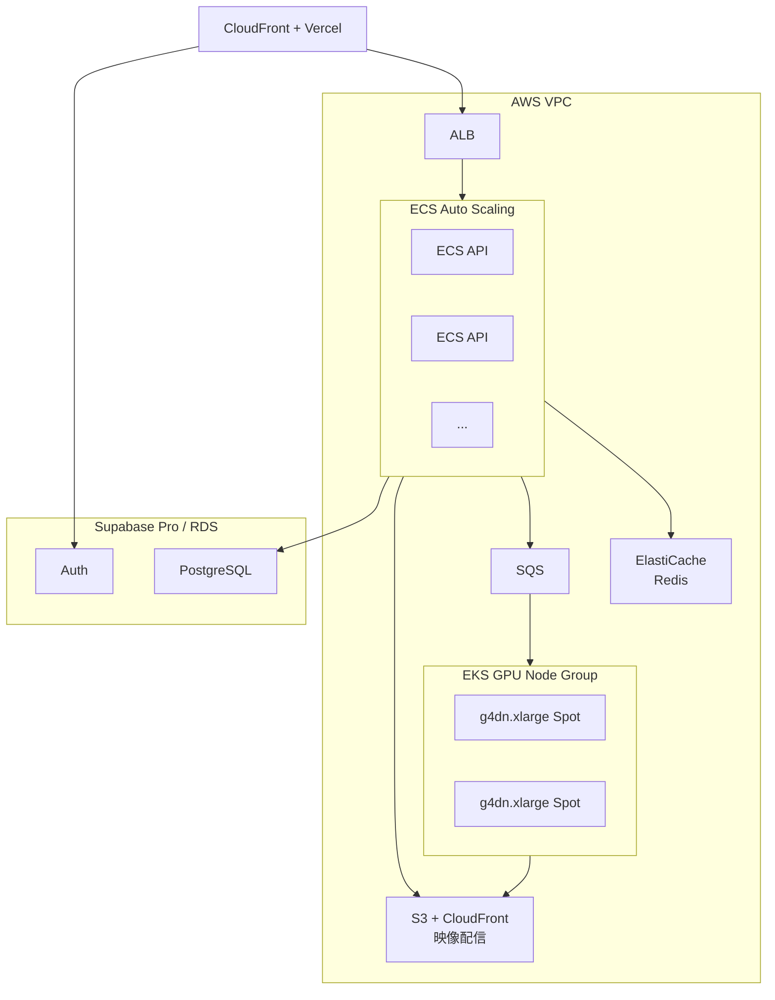
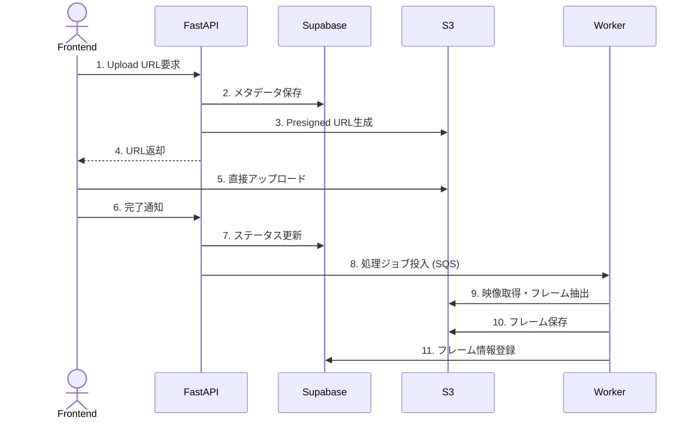
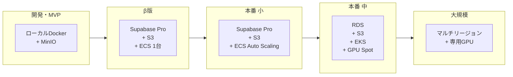

# Argus - インフラストラクチャ構成

## ハイブリッド構成: Supabase + AWS

認証・メタデータ管理にSupabaseを使用し、映像処理・AI推論にAWSを使用するハイブリッド構成。



## 環境別構成

### ローカル開発環境



```yaml
# docker-compose.yml
version: '3.8'

services:
  # Supabase互換ローカル環境
  supabase-db:
    image: supabase/postgres:15.1.0.117
    ports:
      - "5432:5432"
    environment:
      POSTGRES_PASSWORD: postgres
    volumes:
      - supabase-db:/var/lib/postgresql/data

  supabase-auth:
    image: supabase/gotrue:v2.132.3
    depends_on:
      - supabase-db
    ports:
      - "9999:9999"
    environment:
      GOTRUE_SITE_URL: http://localhost:3000
      GOTRUE_JWT_SECRET: super-secret-jwt-token-for-dev

  supabase-studio:
    image: supabase/studio:20231123-64a766a
    ports:
      - "3001:3000"

  # S3互換ローカルストレージ
  minio:
    image: minio/minio:latest
    ports:
      - "9000:9000"
      - "9001:9001"
    command: server /data --console-address ":9001"
    environment:
      MINIO_ROOT_USER: minioadmin
      MINIO_ROOT_PASSWORD: minioadmin
    volumes:
      - minio-data:/data

  # Redis (Celery Queue)
  redis:
    image: redis:7-alpine
    ports:
      - "6379:6379"

  # FastAPI Backend
  api:
    build:
      context: ./backend
      dockerfile: Dockerfile
    ports:
      - "8000:8000"
    environment:
      - ENVIRONMENT=development
      - SUPABASE_URL=http://supabase-auth:9999
      - SUPABASE_JWT_SECRET=super-secret-jwt-token-for-dev
      - S3_ENDPOINT=http://minio:9000
      - S3_ACCESS_KEY=minioadmin
      - S3_SECRET_KEY=minioadmin
      - S3_BUCKET=argus-videos
      - REDIS_URL=redis://redis:6379
    volumes:
      - ./backend:/app
    depends_on:
      - supabase-db
      - minio
      - redis

  # Celery Worker
  worker:
    build:
      context: ./backend
      dockerfile: Dockerfile
    command: celery -A app.worker worker --loglevel=info
    environment:
      - ENVIRONMENT=development
      - REDIS_URL=redis://redis:6379
      - S3_ENDPOINT=http://minio:9000
    volumes:
      - ./backend:/app
    depends_on:
      - redis
      - minio

  # Frontend
  frontend:
    build:
      context: ./frontend
      dockerfile: Dockerfile.dev
    ports:
      - "3000:3000"
    environment:
      - NEXT_PUBLIC_SUPABASE_URL=http://localhost:9999
      - NEXT_PUBLIC_API_URL=http://localhost:8000
    volumes:
      - ./frontend:/app
      - /app/node_modules

volumes:
  supabase-db:
  minio-data:
```

### ステージング環境



### 本番環境



## 映像アップロードフロー

ユーザーはPresigned URLを使用してS3に直接アップロード（サーバー負荷軽減）。



## 段階的スケールアップ



| フェーズ | 構成 | 想定規模 | 月額コスト目安 |
|---------|------|---------|---------------|
| 開発・MVP | ローカルDocker + MinIO | 〜100本 | $0 |
| β版 | Supabase Pro + S3 + ECS (1台) | 〜1,000本 | ~$100 |
| 本番 (小) | Supabase Pro + S3 + ECS Auto Scaling | 〜10,000本 | ~$300 |
| 本番 (中) | RDS + S3 + EKS + GPU Spot | 〜100,000本 | ~$1,000 |
| 大規模 | マルチリージョン + 専用GPU | 100万本〜 | 要見積 |

## セキュリティ考慮事項

### 認証・認可
- Supabase Auth による認証（OAuth、Magic Link）
- JWT による API 認可
- Row Level Security (RLS) によるデータ分離

### ネットワーク
- VPC 内でのサービス間通信
- S3 VPC Endpoint によるプライベートアクセス
- WAF による API 保護

### データ保護
- S3 サーバーサイド暗号化 (SSE-S3)
- PostgreSQL 暗号化
- TLS 1.3 による通信暗号化

### 監査
- CloudTrail によるAPI操作ログ
- Supabase ログによる認証ログ

## コスト最適化戦略

1. **GPU インスタンス**: Spot Instance 活用（最大70%削減）
2. **S3**: Intelligent-Tiering で自動階層化
3. **ECS**: Fargate Spot で API コスト削減
4. **映像処理**: 必要なフレームのみ抽出・保存
5. **CDN**: CloudFront でオリジン負荷軽減
