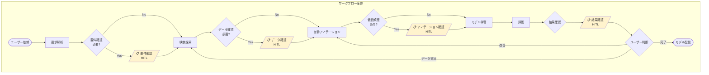
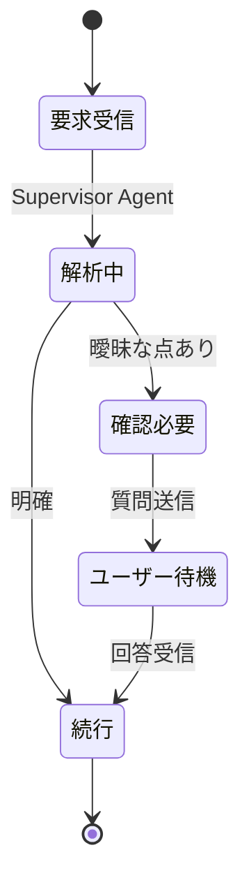
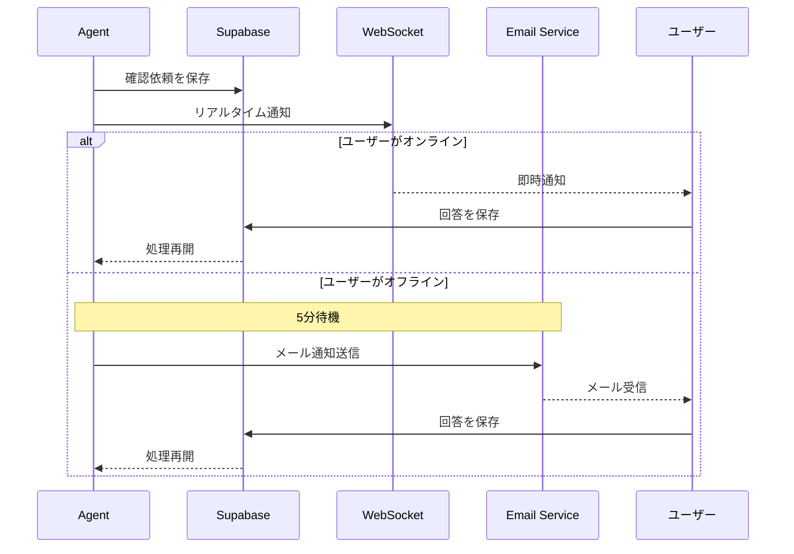
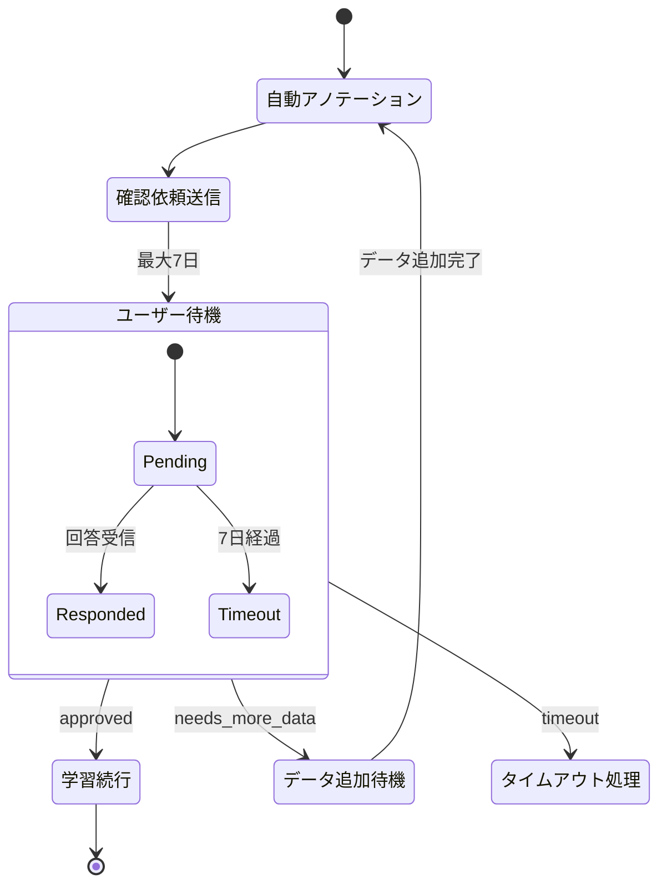
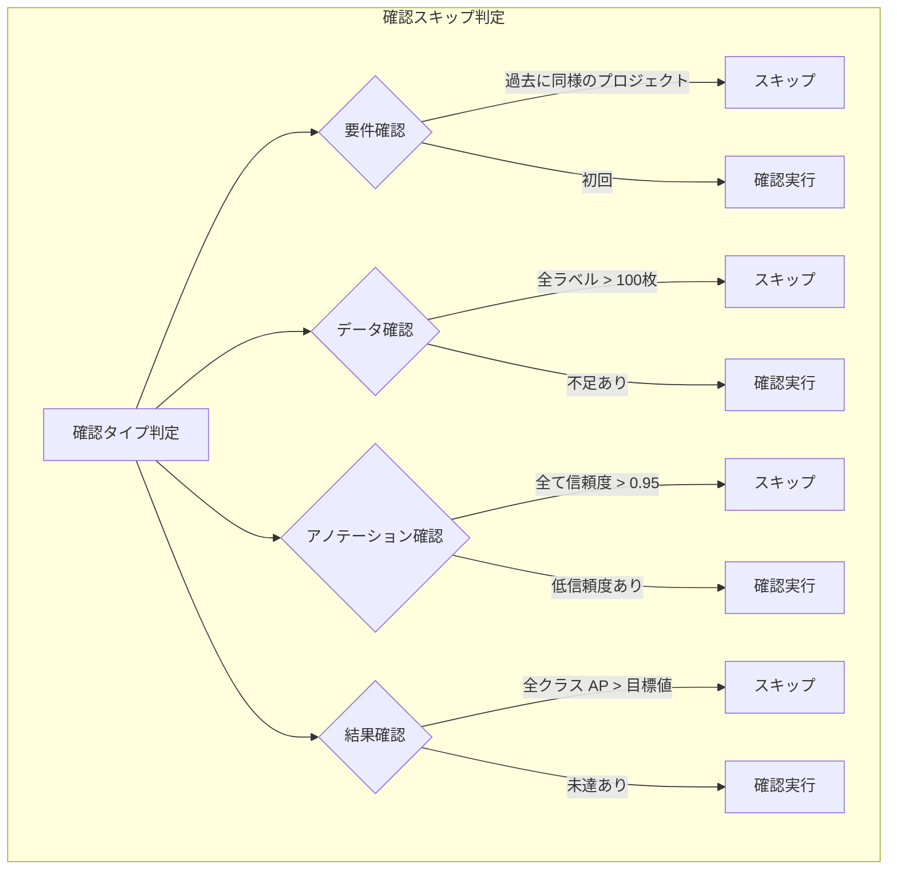
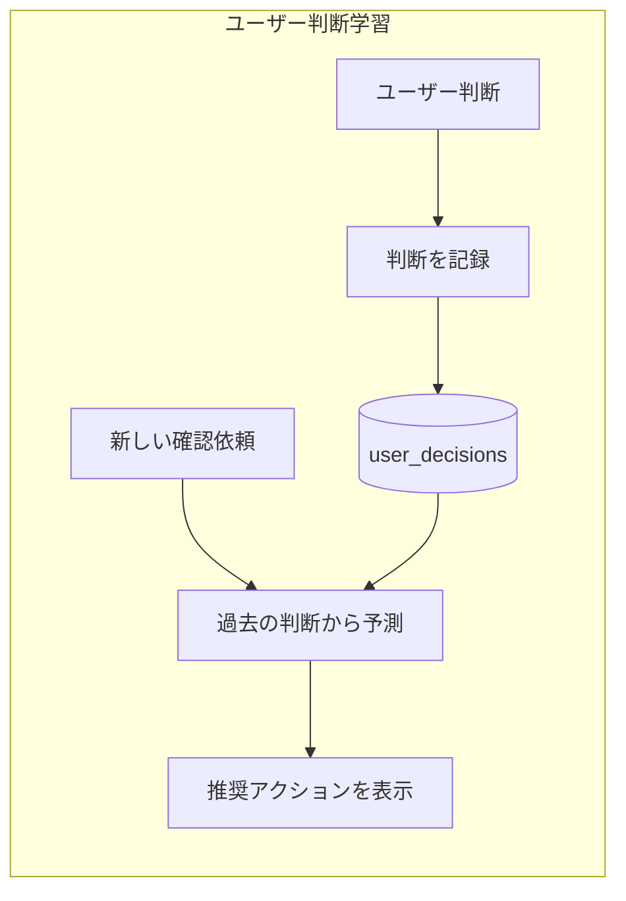

# Argus - Human-in-the-Loop 設計

## 概要

AIエージェントが自律的に処理を進めつつ、重要な判断ポイントでユーザーに確認を求めることで、効率と品質を両立する。

## 設計原則

1. **最小限の介入**: ユーザーに確認するのは本当に必要な場合のみ
2. **明確な選択肢**: 曖昧な質問ではなく、具体的な選択肢を提示
3. **非同期対応**: ユーザーが即座に応答しなくても処理を中断しない
4. **学習機能**: ユーザーの判断パターンを学習し、将来的に自動化

## 全体フロー



## 確認ポイント詳細

### 1. 要件確認 (Requirements Clarification)



**タイミング**: プロジェクト開始時

**目的**: ユーザーの意図を正確に理解する

**確認内容**:
- 検出対象の確認（例: "person" = 作業者？）
- 撮影環境の確認（工場ライン / デスク上 / 倉庫）
- 精度優先度（速度優先 / 精度優先 / バランス型）

### 2. データ確認 (Data Review)

**タイミング**: Scout Agentが候補映像を発見した後

**目的**: 適切なデータが選択されているか確認

**確認内容**:
- サンプル画像のプレビュー
- ラベル別の枚数集計
- 不足しているラベルの警告
- アクション選択（続行 / データ追加 / ラベル除外）

### 3. アノテーション確認 (Annotation Review)

**タイミング**: SAM 3 による自動アノテーションで信頼度が低いものがある場合

**目的**: アノテーション品質の担保

**確認内容**:
- 総アノテーション数と自動承認数
- 信頼度の低い画像のレビューUI
- バウンディングボックスの修正ツール
- ラベル変更・削除オプション

### 4. 学習結果確認 (Training Results Review)

**タイミング**: モデル学習完了後

**目的**: モデル品質の最終確認と次のアクション決定

**確認内容**:
- 全体 mAP と クラス別 AP
- 成功例・失敗例のサンプル
- AIによる改善提案
- 次のアクション選択

## 通知・待機メカニズム



### リアルタイム通知 (WebSocket)

```typescript
// Frontend
const { data } = useSubscription('review_requests', {
  filter: `project_id=eq.${projectId}`
});

useEffect(() => {
  if (data?.type === 'annotation_review') {
    showNotification('アノテーション確認が必要です');
  }
}, [data]);
```

### 非同期通知 (Email)

```python
# Backend
async def request_user_review(project_id: str, review_type: str):
    # 1. DBに確認依頼を保存
    await supabase.table('review_requests').insert({
        'project_id': project_id,
        'type': review_type,
        'status': 'pending'
    }).execute()

    # 2. WebSocketで通知
    await broadcast_to_project(project_id, {
        'type': 'review_requested',
        'review_type': review_type
    })

    # 3. 5分後にまだ未対応ならメール送信
    await schedule_email_notification(
        project_id=project_id,
        delay_minutes=5,
        subject='Argus: 確認が必要です'
    )
```

### ワークフロー待機 (Temporal)



```python
# workflow.py
@workflow.defn
class TrainingWorkflow:
    @workflow.run
    async def run(self, project_id: str):
        # ... 自動アノテーション完了 ...

        # Human-in-the-Loop: ユーザー確認を待機
        review_result = await workflow.execute_activity(
            request_annotation_review,
            args=[project_id],
            start_to_close_timeout=timedelta(days=7)  # 最大7日待機
        )

        if review_result.action == 'approved':
            # 学習を続行
            await workflow.execute_activity(train_model, ...)
        elif review_result.action == 'needs_more_data':
            # データ追加を待機
            await workflow.wait_condition(
                lambda: self.additional_data_uploaded
            )
```

## 確認スキップ条件



| 確認タイプ | スキップ条件 |
|-----------|-------------|
| 要件確認 | 過去に同様のプロジェクトを作成済み |
| データ確認 | 全ラベルで十分なデータ量がある (>100枚) |
| アノテーション確認 | 信頼度が全て0.95以上 |
| 結果確認 | 全クラスのAPが目標値以上 |

```python
async def should_skip_review(project_id: str, review_type: str) -> bool:
    project = await get_project(project_id)
    user_prefs = await get_user_preferences(project.owner_id)

    if review_type == 'annotation':
        low_confidence = await count_low_confidence_annotations(project_id)
        return low_confidence == 0 and user_prefs.auto_approve_high_confidence

    # ... 他の条件 ...
```

## ユーザー学習機能



```python
# ユーザーの判断を記録
async def record_user_decision(
    user_id: str,
    review_type: str,
    context: dict,
    decision: str
):
    await supabase.table('user_decisions').insert({
        'user_id': user_id,
        'review_type': review_type,
        'context': context,
        'decision': decision,
        'created_at': datetime.utcnow()
    }).execute()

# 過去の判断パターンから予測
async def predict_user_decision(
    user_id: str,
    review_type: str,
    context: dict
) -> tuple[str, float]:  # (予測, 信頼度)
    similar_decisions = await find_similar_decisions(user_id, context)

    if len(similar_decisions) >= 5:
        most_common = Counter(d.decision for d in similar_decisions).most_common(1)[0]
        confidence = most_common[1] / len(similar_decisions)
        return most_common[0], confidence

    return None, 0.0
```
