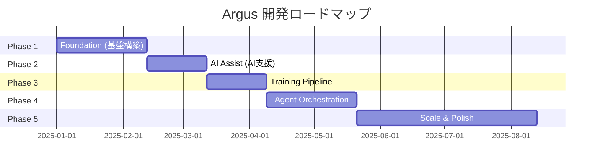
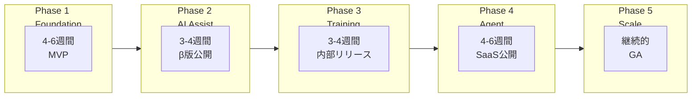
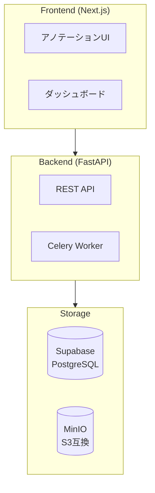
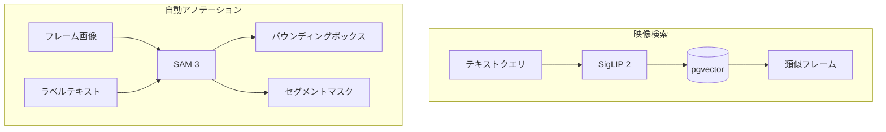
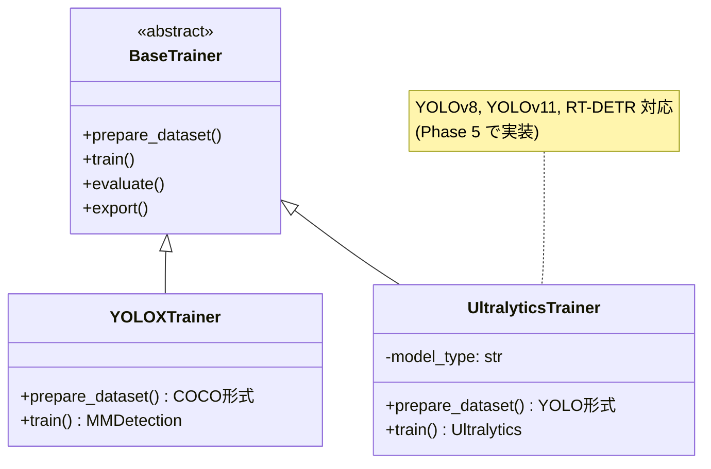
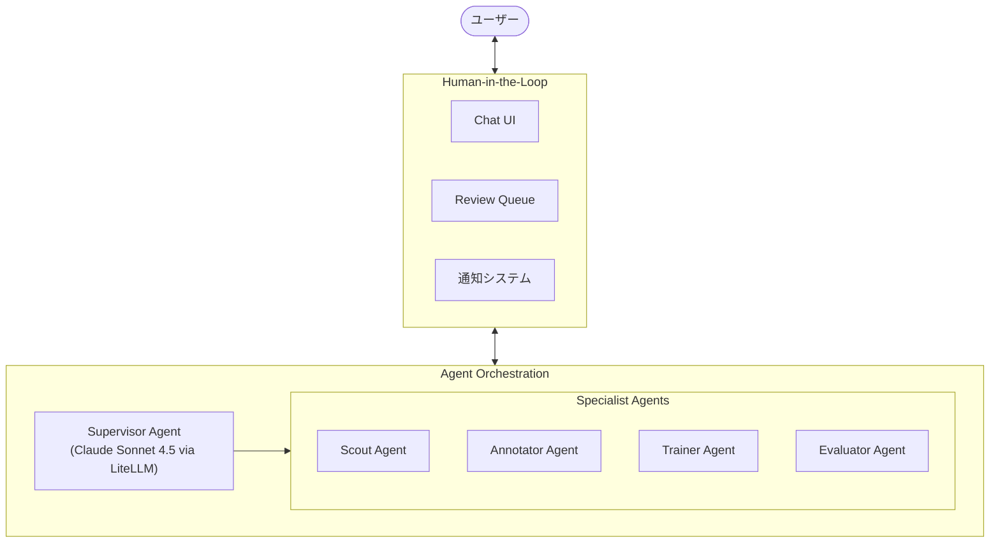
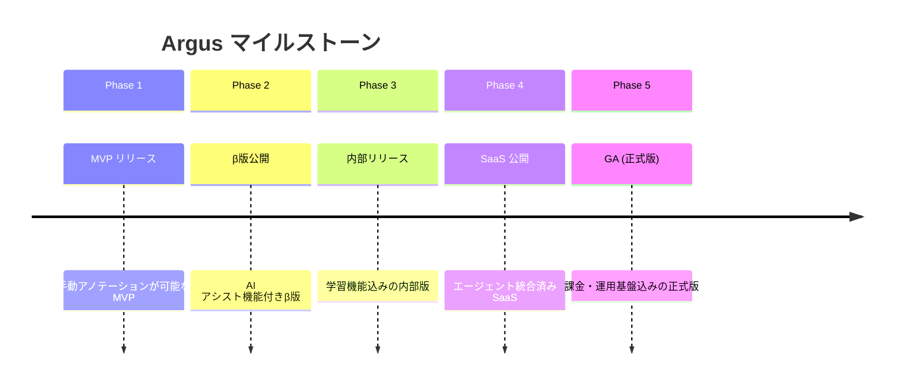

# Argus - 実装フェーズ

## フェーズ概要





---

## Phase 1: Foundation (基盤構築)

### 目標
映像アップロードから手動アノテーション、データエクスポートまでの基本フローを構築

### 期間
4-6週間

### 成果物
- 動作するMVP
- ローカル開発環境
- 基本的なアノテーションUI

### アーキテクチャ



### タスク一覧

#### 1.1 プロジェクト初期設定
- [ ] リポジトリ構造の作成
  ```
  argus/
  ├── frontend/          # Next.js
  ├── backend/           # FastAPI
  ├── worker/            # Celery Worker
  ├── docker/            # Docker設定
  ├── docs/              # ドキュメント
  └── .plans/            # 計画書
  ```
- [ ] Docker Compose 環境構築
- [ ] CI/CD パイプライン (GitHub Actions)
- [ ] 開発ガイドライン策定

#### 1.2 認証基盤 (Supabase)
- [ ] Supabase プロジェクト作成
- [ ] 認証フロー実装 (Email/OAuth)
- [ ] ローカル開発用の認証スタブ
- [ ] FastAPI での JWT 検証ミドルウェア

#### 1.3 データベース設計
- [ ] スキーマ設計 (users, projects, videos, frames, labels, annotations)
- [ ] マイグレーション設定
- [ ] Row Level Security (RLS) 設定

#### 1.4 映像管理
- [ ] 映像アップロード API (Presigned URL)
- [ ] MinIO ローカル設定
- [ ] フレーム抽出 Worker (FFmpeg)
- [ ] サムネイル生成
- [ ] 映像一覧・詳細 UI

#### 1.5 アノテーション基盤
- [ ] プロジェクト作成 UI
- [ ] ラベル管理 UI
- [ ] アノテーション Canvas UI (Konva.js / react-konva)
  - バウンディングボックス描画
  - 編集・削除
  - ズーム・パン
- [ ] アノテーション保存 API

#### 1.6 データエクスポート
- [ ] COCO 形式エクスポート
- [ ] YOLO 形式エクスポート
- [ ] エクスポート UI

### 完了基準
- [ ] ユーザーがログインできる
- [ ] 映像をアップロードできる
- [ ] フレームが自動抽出される
- [ ] 手動でバウンディングボックスを描画できる
- [ ] COCO 形式でエクスポートできる

---

## Phase 2: AI Assist (AI支援機能)

### 目標
AI による自動アノテーションと映像検索機能の実装

### 期間
3-4週間

### 前提条件
- Phase 1 完了

### アーキテクチャ



### タスク一覧

#### 2.1 SigLIP 2 による映像検索
- [ ] SigLIP 2 モデル統合 (Hugging Face transformers)
- [ ] フレームの特徴ベクトル抽出 Worker
- [ ] pgvector 拡張設定
- [ ] テキスト → 類似フレーム検索 API
- [ ] 検索 UI

#### 2.2 SAM 3 による自動アノテーション
- [ ] SAM 3 モデル統合 (facebookresearch/sam3)
- [ ] テキストプロンプト → バウンディングボックス + マスク生成
- [ ] 信頼度スコア表示
- [ ] バッチ処理 Worker
- [ ] (フォールバック) Grounding DINO + SAM 2 対応

#### 2.3 アノテーションレビュー
- [ ] 信頼度によるフィルタリング
- [ ] 一括承認 UI
- [ ] 修正 UI の改善
- [ ] レビュー進捗表示

#### 2.4 GPU 環境
- [ ] GPU Worker 用 Dockerfile (SigLIP/SAM3 分離コンテナ)
  - `Dockerfile.siglip`: transformers stable
  - `Dockerfile.sam3`: transformers dev + SAM3
- [ ] ローカル GPU 対応 (CUDA 12.1+, NVIDIA Container Toolkit)
- [ ] モデルキャッシュ (共有ボリューム)

### 完了基準
- [ ] 「cpu」と入力すると CPU が映ったフレームが検索できる
- [ ] 選択したフレームに自動でバウンディングボックスが生成される
- [ ] 信頼度の低いアノテーションをレビューできる

---

## Phase 3: Training Pipeline (学習パイプライン)

### 目標
アノテーションデータからモデルを学習し、評価する機能の実装（プラガブル設計）

### 期間
3-4週間

### 前提条件
- Phase 2 完了

### アーキテクチャ



### タスク一覧

#### 3.1 データセット生成
- [ ] Train/Val/Test 分割ロジック
- [ ] COCO/YOLO 形式変換 (共通インターフェース)
- [ ] データ拡張オプション
- [ ] データセットバージョニング

#### 3.2 Trainer 抽象化
- [ ] BaseTrainer インターフェース設計
- [ ] YOLOX Trainer 実装 (MMDetection)
- [ ] 設定ファイル形式の統一

#### 3.3 学習パイプライン
- [ ] 学習設定 UI (epochs, batch size, model type)
- [ ] 学習ジョブ Worker
- [ ] 学習進捗のリアルタイム表示 (Loss, mAP)
- [ ] 学習中断・再開

#### 3.4 モデル評価
- [ ] mAP 計算 (共通評価ロジック)
- [ ] クラス別精度分析
- [ ] 混同行列
- [ ] 失敗ケース可視化
- [ ] 評価レポート生成

#### 3.5 モデル管理
- [ ] MLflow 統合
- [ ] モデルバージョン管理
- [ ] モデル比較 UI
- [ ] モデルダウンロード

#### 3.6 AWS GPU 環境
- [ ] EC2 g4dn.xlarge 設定
- [ ] Spot Instance 対応
- [ ] 学習ジョブスケジューリング

### 完了基準
- [ ] アノテーションデータから学習ジョブを開始できる
- [ ] 学習進捗がリアルタイムで確認できる
- [ ] 学習完了後に mAP とクラス別精度が表示される
- [ ] 学習済みモデルをダウンロードできる

---

## Phase 4: Agent Orchestration (エージェント統合)

### 目標
LLM エージェントによる自律的なワークフロー実行と Human-in-the-Loop の実装

### 期間
4-6週間

### 前提条件
- Phase 3 完了

### アーキテクチャ



### タスク一覧

#### 4.1 LiteLLM + LangGraph 基盤
- [ ] LiteLLM 設定 (Claude Sonnet 4.5 デフォルト)
- [ ] モデル切り替え機能
- [ ] LangGraph プロジェクト設定
- [ ] ステート定義 (ProjectState)
- [ ] チェックポイント (PostgreSQL)
- [ ] 基本ワークフローグラフ

#### 4.2 Supervisor Agent
- [ ] ユーザー要求解析プロンプト
- [ ] タスク分解ロジック
- [ ] 品質判断ロジック
- [ ] HITL 判断ロジック

#### 4.3 専門エージェント
- [ ] Scout Agent (映像探索)
  - ラベル → 検索クエリ展開
  - 候補フレーム収集
  - サマリー生成
- [ ] Annotator Agent (アノテーション)
  - 自動アノテーション実行
  - 品質評価
  - レビュー依頼判断
- [ ] Trainer Agent (学習)
  - ハイパーパラメータ選択
  - 学習実行
  - 進捗監視
- [ ] Evaluator Agent (評価)
  - 精度分析
  - 改善提案生成

#### 4.4 Human-in-the-Loop
- [ ] 確認依頼 UI
- [ ] 確認待ち状態管理
- [ ] 通知システム (WebSocket + Email)
- [ ] 確認スキップ条件

#### 4.5 Chat Interface
- [ ] チャット UI
- [ ] メッセージ履歴表示
- [ ] 進捗インジケーター
- [ ] エラーハンドリング

#### 4.6 Temporal 統合 (オプション)
- [ ] Temporal Server 設定
- [ ] Workflow 定義
- [ ] Activity 定義
- [ ] 長時間実行対応

### 完了基準
- [ ] 「person, cpu で YOLOX を作成」と入力するとワークフローが開始される
- [ ] AI が適切なタイミングで確認依頼を送ってくる
- [ ] ユーザーの回答に基づいてワークフローが進行する
- [ ] 最終的に学習済みモデルが生成される

---

## Phase 5: Scale & Polish (本番化)

### 目標
SaaS としての品質担保、スケーラビリティ確保、運用基盤構築、モデル拡張

### 期間
継続的

### タスク一覧

#### 5.1 追加モデル対応
- [ ] UltralyticsTrainer 実装 (YOLOv8, YOLOv11, RT-DETR)
- [ ] モデル選択 UI
- [ ] モデル別の推奨設定
- [ ] セグメンテーションモデル対応 (将来)

#### 5.2 マルチテナント
- [ ] テナント分離の強化
- [ ] リソース制限 (Quotas)
- [ ] テナント別設定

#### 5.3 課金・使用量管理
- [ ] Stripe 統合
- [ ] プラン設計 (Free/Pro/Enterprise)
- [ ] 使用量トラッキング
- [ ] 請求書生成

#### 5.4 モデル配信
- [ ] ONNX 変換
- [ ] TensorRT 変換 (オプション)
- [ ] モデル API 提供
- [ ] エッジデプロイガイド

#### 5.5 監視・運用
- [ ] ログ集約 (CloudWatch)
- [ ] メトリクス監視
- [ ] アラート設定
- [ ] 障害対応 Runbook

#### 5.6 パフォーマンス最適化
- [ ] CDN 設定
- [ ] キャッシュ戦略
- [ ] DB インデックス最適化
- [ ] Worker オートスケーリング

#### 5.7 セキュリティ
- [ ] ペネトレーションテスト
- [ ] 脆弱性スキャン
- [ ] SOC2 準備 (必要に応じて)

#### 5.8 ドキュメント
- [ ] ユーザーガイド
- [ ] API ドキュメント
- [ ] チュートリアル動画
- [ ] FAQ

---

## マイルストーン



| マイルストーン | フェーズ | 成果物 |
|--------------|---------|-------|
| MVP リリース | Phase 1 完了 | 手動アノテーションが可能な MVP |
| β版公開 | Phase 2 完了 | AI アシスト機能付きβ版 |
| 内部リリース | Phase 3 完了 | 学習機能込みの内部版 |
| SaaS 公開 | Phase 4 完了 | エージェント統合済み SaaS |
| GA (正式版) | Phase 5 進行中 | 課金・運用基盤込みの正式版 |

---

## リスクと対策

| リスク | 影響 | 対策 |
|-------|------|------|
| GPU コストの増大 | 運用コスト増 | Spot Instance、オンデマンド起動 |
| AI アノテーション精度不足 | UX 低下 | Human-in-the-Loop で品質担保、SAM 3 採用 |
| LLM API コスト | 運用コスト増 | LiteLLM でモデル切り替え、キャッシュ |
| 開発遅延 | リリース遅延 | フェーズ分割、MVP 優先 |
| セキュリティ脆弱性 | 信頼失墜 | 早期からのセキュリティレビュー |
| モデル陳腐化 | 競争力低下 | プラガブル設計で新モデル追加容易 |

---

## 次のステップ

1. **Phase 1 の詳細タスク分解**: 各タスクを 1-2 日単位に分解
2. **リポジトリ初期化**: プロジェクト構造の作成
3. **開発環境構築**: Docker Compose 設定
4. **認証基盤**: Supabase 設定とログインフロー実装

Phase 1 の詳細実装計画を別ドキュメントで策定することを推奨。
