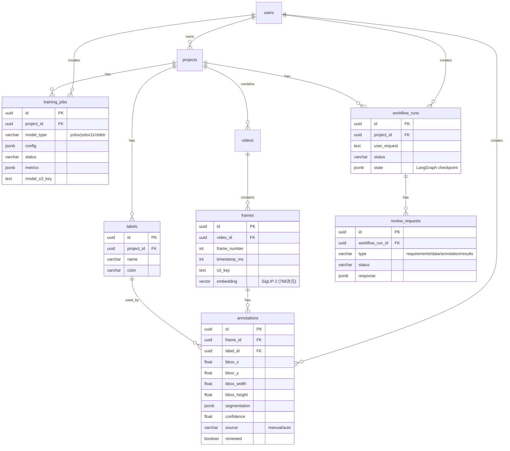
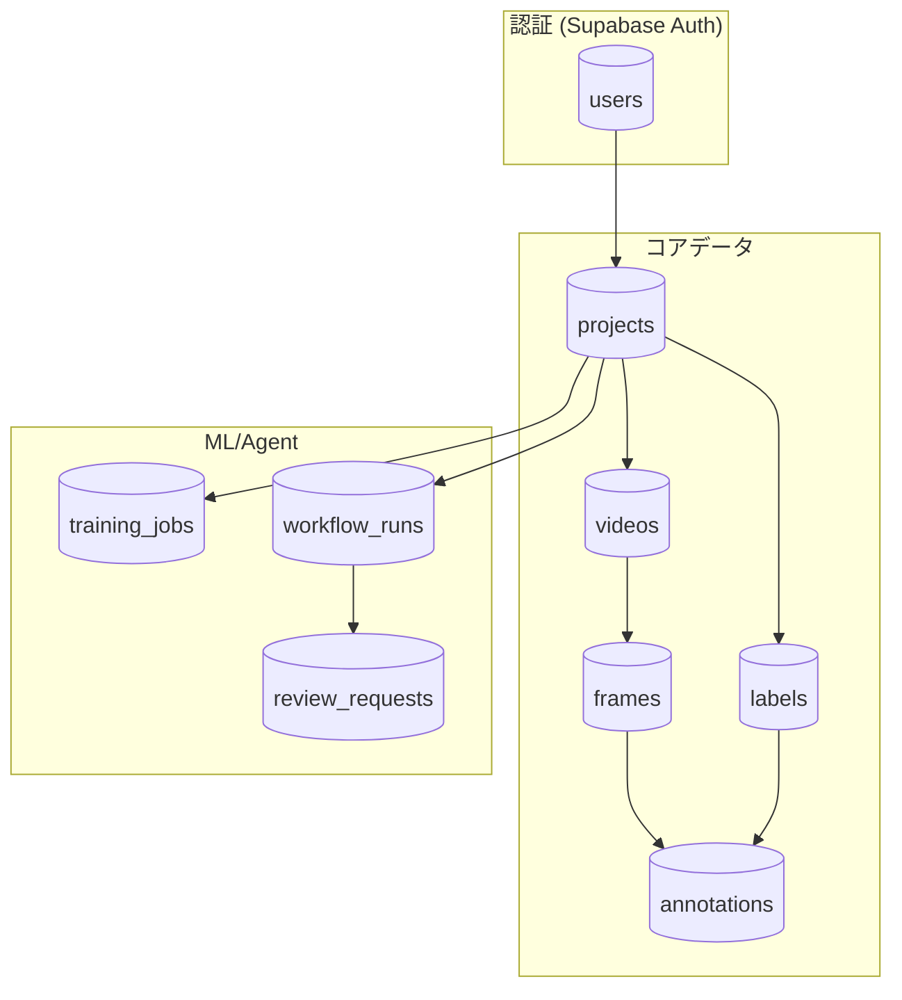

# Argus - データベーススキーマ設計

## 概要

Supabase (PostgreSQL) をメインデータベースとして使用。
映像ファイル自体は S3 に保存し、メタデータのみ DB に格納。

## ER 図



### テーブル関連図（簡易版）



## テーブル定義

### users (Supabase Auth 管理)

Supabase Auth が自動管理。追加のユーザー情報は `profiles` テーブルで管理。

```sql
-- Supabase が自動作成する auth.users を参照
CREATE TABLE public.profiles (
    id UUID PRIMARY KEY REFERENCES auth.users(id) ON DELETE CASCADE,
    display_name VARCHAR(255),
    avatar_url TEXT,
    preferences JSONB DEFAULT '{}',
    created_at TIMESTAMPTZ DEFAULT NOW(),
    updated_at TIMESTAMPTZ DEFAULT NOW()
);

-- RLS
ALTER TABLE profiles ENABLE ROW LEVEL SECURITY;

CREATE POLICY "Users can view own profile"
    ON profiles FOR SELECT
    USING (auth.uid() = id);

CREATE POLICY "Users can update own profile"
    ON profiles FOR UPDATE
    USING (auth.uid() = id);
```

### projects

```sql
CREATE TABLE projects (
    id UUID PRIMARY KEY DEFAULT gen_random_uuid(),
    owner_id UUID NOT NULL REFERENCES auth.users(id) ON DELETE CASCADE,
    name VARCHAR(255) NOT NULL,
    description TEXT,
    status VARCHAR(50) DEFAULT 'active',  -- active, archived, deleted
    settings JSONB DEFAULT '{}',
    created_at TIMESTAMPTZ DEFAULT NOW(),
    updated_at TIMESTAMPTZ DEFAULT NOW()
);

CREATE INDEX idx_projects_owner ON projects(owner_id);

-- RLS
ALTER TABLE projects ENABLE ROW LEVEL SECURITY;

CREATE POLICY "Users can view own projects"
    ON projects FOR SELECT
    USING (auth.uid() = owner_id);

CREATE POLICY "Users can create projects"
    ON projects FOR INSERT
    WITH CHECK (auth.uid() = owner_id);

CREATE POLICY "Users can update own projects"
    ON projects FOR UPDATE
    USING (auth.uid() = owner_id);

CREATE POLICY "Users can delete own projects"
    ON projects FOR DELETE
    USING (auth.uid() = owner_id);
```

### labels

```sql
CREATE TABLE labels (
    id UUID PRIMARY KEY DEFAULT gen_random_uuid(),
    project_id UUID NOT NULL REFERENCES projects(id) ON DELETE CASCADE,
    name VARCHAR(255) NOT NULL,
    color VARCHAR(7) DEFAULT '#FF0000',  -- Hex color
    description TEXT,
    sort_order INTEGER DEFAULT 0,
    created_at TIMESTAMPTZ DEFAULT NOW(),

    UNIQUE(project_id, name)
);

CREATE INDEX idx_labels_project ON labels(project_id);

-- RLS
ALTER TABLE labels ENABLE ROW LEVEL SECURITY;

CREATE POLICY "Users can manage labels in own projects"
    ON labels FOR ALL
    USING (
        EXISTS (
            SELECT 1 FROM projects
            WHERE projects.id = labels.project_id
            AND projects.owner_id = auth.uid()
        )
    );
```

### videos

```sql
CREATE TABLE videos (
    id UUID PRIMARY KEY DEFAULT gen_random_uuid(),
    project_id UUID NOT NULL REFERENCES projects(id) ON DELETE CASCADE,
    filename VARCHAR(255) NOT NULL,
    original_filename VARCHAR(255) NOT NULL,
    s3_key TEXT NOT NULL,
    mime_type VARCHAR(100),
    file_size BIGINT,
    duration_seconds FLOAT,
    width INTEGER,
    height INTEGER,
    fps FLOAT,
    frame_count INTEGER,
    status VARCHAR(50) DEFAULT 'uploading',  -- uploading, processing, ready, failed
    error_message TEXT,
    metadata JSONB DEFAULT '{}',
    created_at TIMESTAMPTZ DEFAULT NOW(),
    updated_at TIMESTAMPTZ DEFAULT NOW()
);

CREATE INDEX idx_videos_project ON videos(project_id);
CREATE INDEX idx_videos_status ON videos(status);

-- RLS
ALTER TABLE videos ENABLE ROW LEVEL SECURITY;

CREATE POLICY "Users can manage videos in own projects"
    ON videos FOR ALL
    USING (
        EXISTS (
            SELECT 1 FROM projects
            WHERE projects.id = videos.project_id
            AND projects.owner_id = auth.uid()
        )
    );
```

### frames

```sql
-- pgvector 拡張を有効化
CREATE EXTENSION IF NOT EXISTS vector;

CREATE TABLE frames (
    id UUID PRIMARY KEY DEFAULT gen_random_uuid(),
    video_id UUID NOT NULL REFERENCES videos(id) ON DELETE CASCADE,
    frame_number INTEGER NOT NULL,
    timestamp_ms INTEGER NOT NULL,
    s3_key TEXT NOT NULL,
    thumbnail_s3_key TEXT,
    width INTEGER,
    height INTEGER,
    embedding vector(768),  -- SigLIP 2 base の次元数
    created_at TIMESTAMPTZ DEFAULT NOW(),

    UNIQUE(video_id, frame_number)
);

CREATE INDEX idx_frames_video ON frames(video_id);
CREATE INDEX idx_frames_embedding_hnsw ON frames USING hnsw (embedding vector_cosine_ops)
    WITH (m = 16, ef_construction = 64);  -- HNSW: 高速クエリ、事前学習データ不要

-- RLS
ALTER TABLE frames ENABLE ROW LEVEL SECURITY;

CREATE POLICY "Users can manage frames in own projects"
    ON frames FOR ALL
    USING (
        EXISTS (
            SELECT 1 FROM videos
            JOIN projects ON projects.id = videos.project_id
            WHERE videos.id = frames.video_id
            AND projects.owner_id = auth.uid()
        )
    );
```

### annotations

```sql
CREATE TABLE annotations (
    id UUID PRIMARY KEY DEFAULT gen_random_uuid(),
    frame_id UUID NOT NULL REFERENCES frames(id) ON DELETE CASCADE,
    label_id UUID NOT NULL REFERENCES labels(id) ON DELETE CASCADE,

    -- Bounding Box (normalized 0-1)
    bbox_x FLOAT NOT NULL,
    bbox_y FLOAT NOT NULL,
    bbox_width FLOAT NOT NULL,
    bbox_height FLOAT NOT NULL,

    -- Segmentation (optional, for future)
    segmentation JSONB,  -- [[x1,y1,x2,y2,...], ...]

    -- Metadata
    confidence FLOAT,  -- AI予測の場合の信頼度
    source VARCHAR(50) DEFAULT 'manual',  -- manual, auto, imported
    reviewed BOOLEAN DEFAULT FALSE,
    reviewed_by UUID REFERENCES auth.users(id),
    reviewed_at TIMESTAMPTZ,

    created_by UUID NOT NULL REFERENCES auth.users(id),
    created_at TIMESTAMPTZ DEFAULT NOW(),
    updated_at TIMESTAMPTZ DEFAULT NOW()
);

CREATE INDEX idx_annotations_frame ON annotations(frame_id);
CREATE INDEX idx_annotations_label ON annotations(label_id);
CREATE INDEX idx_annotations_source ON annotations(source);
CREATE INDEX idx_annotations_confidence ON annotations(confidence);

-- RLS
ALTER TABLE annotations ENABLE ROW LEVEL SECURITY;

CREATE POLICY "Users can manage annotations in own projects"
    ON annotations FOR ALL
    USING (
        EXISTS (
            SELECT 1 FROM frames
            JOIN videos ON videos.id = frames.video_id
            JOIN projects ON projects.id = videos.project_id
            WHERE frames.id = annotations.frame_id
            AND projects.owner_id = auth.uid()
        )
    );
```

### training_jobs

```sql
CREATE TABLE training_jobs (
    id UUID PRIMARY KEY DEFAULT gen_random_uuid(),
    project_id UUID NOT NULL REFERENCES projects(id) ON DELETE CASCADE,

    -- 設定
    model_type VARCHAR(50) DEFAULT 'yolox',
    config JSONB NOT NULL,  -- epochs, batch_size, etc.

    -- 状態
    status VARCHAR(50) DEFAULT 'pending',  -- pending, running, completed, failed, cancelled
    progress FLOAT DEFAULT 0,  -- 0-100

    -- 結果
    metrics JSONB,  -- mAP, per-class AP, etc.
    model_s3_key TEXT,
    training_log_s3_key TEXT,

    -- メタデータ
    started_at TIMESTAMPTZ,
    completed_at TIMESTAMPTZ,
    error_message TEXT,

    created_by UUID NOT NULL REFERENCES auth.users(id),
    created_at TIMESTAMPTZ DEFAULT NOW(),
    updated_at TIMESTAMPTZ DEFAULT NOW()
);

CREATE INDEX idx_training_jobs_project ON training_jobs(project_id);
CREATE INDEX idx_training_jobs_status ON training_jobs(status);

-- RLS (略)
```

### workflow_runs (エージェントワークフロー)

```sql
CREATE TABLE workflow_runs (
    id UUID PRIMARY KEY DEFAULT gen_random_uuid(),
    project_id UUID NOT NULL REFERENCES projects(id) ON DELETE CASCADE,

    -- ユーザー入力
    user_request TEXT NOT NULL,
    parsed_labels TEXT[],

    -- 状態
    status VARCHAR(50) DEFAULT 'pending',
    current_step VARCHAR(100),

    -- LangGraph チェックポイント
    state JSONB,

    -- 結果
    final_model_id UUID REFERENCES training_jobs(id),

    created_by UUID NOT NULL REFERENCES auth.users(id),
    created_at TIMESTAMPTZ DEFAULT NOW(),
    updated_at TIMESTAMPTZ DEFAULT NOW()
);

CREATE INDEX idx_workflow_runs_project ON workflow_runs(project_id);
CREATE INDEX idx_workflow_runs_status ON workflow_runs(status);
```

### review_requests (Human-in-the-Loop)

```sql
CREATE TABLE review_requests (
    id UUID PRIMARY KEY DEFAULT gen_random_uuid(),
    workflow_run_id UUID NOT NULL REFERENCES workflow_runs(id) ON DELETE CASCADE,

    -- 確認タイプ
    type VARCHAR(50) NOT NULL,  -- requirements, data, annotation, results

    -- 確認内容
    title VARCHAR(255) NOT NULL,
    description TEXT,
    options JSONB,  -- 選択肢
    context JSONB,  -- サンプル画像など

    -- 状態
    status VARCHAR(50) DEFAULT 'pending',  -- pending, responded, expired
    response JSONB,
    responded_at TIMESTAMPTZ,
    expires_at TIMESTAMPTZ,

    created_at TIMESTAMPTZ DEFAULT NOW()
);

CREATE INDEX idx_review_requests_workflow ON review_requests(workflow_run_id);
CREATE INDEX idx_review_requests_status ON review_requests(status);
```

## ビュー

### プロジェクトサマリー

```sql
CREATE VIEW project_summaries AS
SELECT
    p.id,
    p.name,
    p.owner_id,
    p.status,
    p.created_at,
    COUNT(DISTINCT v.id) AS video_count,
    COUNT(DISTINCT f.id) AS frame_count,
    COUNT(DISTINCT a.id) AS annotation_count,
    COUNT(DISTINCT l.id) AS label_count
FROM projects p
LEFT JOIN videos v ON v.project_id = p.id
LEFT JOIN frames f ON f.video_id = v.id
LEFT JOIN annotations a ON a.frame_id = f.id
LEFT JOIN labels l ON l.project_id = p.id
GROUP BY p.id;
```

### アノテーション統計

```sql
CREATE VIEW annotation_stats AS
SELECT
    l.project_id,
    l.id AS label_id,
    l.name AS label_name,
    COUNT(a.id) AS annotation_count,
    AVG(a.confidence) AS avg_confidence,
    SUM(CASE WHEN a.reviewed THEN 1 ELSE 0 END) AS reviewed_count
FROM labels l
LEFT JOIN annotations a ON a.label_id = l.id
GROUP BY l.project_id, l.id, l.name;
```

## 関数

### 類似フレーム検索

```sql
CREATE OR REPLACE FUNCTION search_similar_frames(
    query_embedding vector(768),
    project_id_filter UUID,
    limit_count INTEGER DEFAULT 100
)
RETURNS TABLE (
    frame_id UUID,
    video_id UUID,
    frame_number INTEGER,
    s3_key TEXT,
    similarity FLOAT
)
LANGUAGE plpgsql
SECURITY DEFINER
SET search_path = public
AS $$
BEGIN
    RETURN QUERY
    SELECT
        f.id,
        f.video_id,
        f.frame_number,
        f.s3_key,
        (1 - (f.embedding <=> query_embedding))::FLOAT AS similarity
    FROM public.frames f
    JOIN public.videos v ON v.id = f.video_id
    WHERE v.project_id = project_id_filter
    AND f.embedding IS NOT NULL
    ORDER BY f.embedding <=> query_embedding
    LIMIT limit_count;
END;
$$;
```

> **Note**: `SECURITY DEFINER` を使用して RLS を回避。呼び出し側で project_id の認可チェックが必要。

## マイグレーション戦略

1. **Supabase Dashboard** で初期スキーマを作成
2. **supabase/migrations/** にマイグレーションファイルを保存
3. **supabase db push** でリモートに適用
4. 変更は必ずマイグレーションファイルとして記録

```bash
# ローカルで変更を作成
supabase migration new add_segmentation_column

# リモートに適用
supabase db push
```
